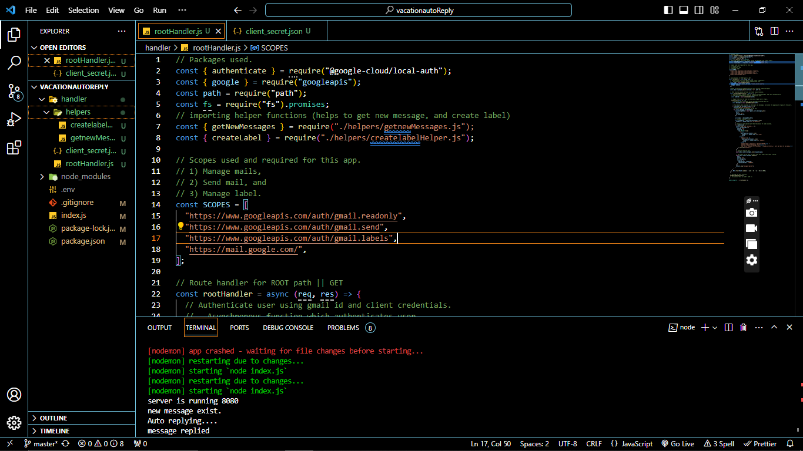

# auto-reply-on-vacation
This application replies automatically to the emails using google mail APIs. 



## Installation Guide

### Requirements
- [Nodejs](https://nodejs.org/en/download)

 ```shell
git clone https://github.com/hvsanthosh/auto-reply-on-vacatio.git
```
-Create credentials on google cloud to use gmail API.
```shell
https://console.cloud.google.com/
```

-Then download the credentials file as .json file.

-Rename credentials has client_secret.json and move the file under root handler folder.

Now install the dependencies.
```shell
npm i
```
-Add PORT=8080 in .env file
-We are almost done, Now just start the  server using this command.
```shell
npm start
```
